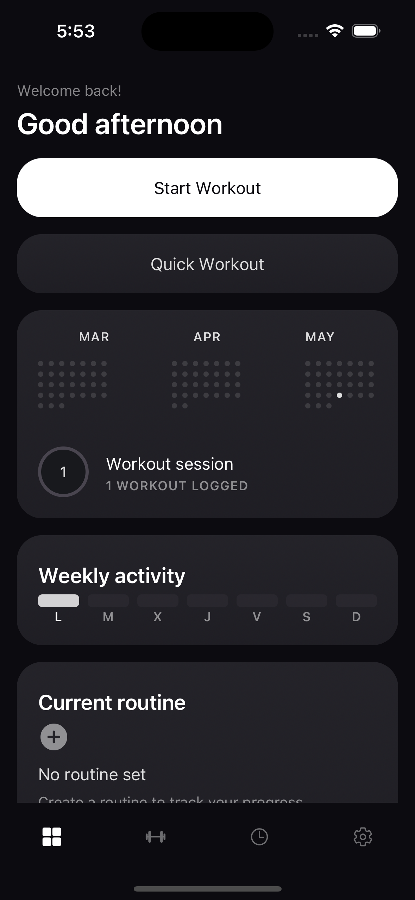

# Zenlift

Zenlift is a mobile-first workout tracker for people who train in the gym and want a fast, reliable way to plan routines, log sets, and understand progress over time.

The product is intentionally focused on one loop:

```text
Create a routine -> Start a workout -> Log sets -> Finish the session -> Review progress
```

It is not a coach dashboard, gym management system, social network, marketplace, or nutrition platform. The goal is a personal training log that feels quick enough to use mid-set and dependable enough to trust with months of workout history.

## Preview

<p align="center">
  
</p>

## What Zenlift Does

- Create routines, training days, and exercise plans.
- Start workouts from a saved routine.
- Log weight, reps, and completed sets quickly.
- Recover active workouts if the app is closed.
- Review workout history and exercise progress.
- Track local data first, without requiring an account or network connection.

## Product Principles

- Active Workout is the most important screen.
- A completed set should be loggable in under 3 seconds.
- Completed workout data should never be lost.
- Core flows must work offline.
- Routine edits must not mutate past workout sessions.
- The interface is dark-first, focused, and designed for one-handed gym use.

## Tech Stack

- [Expo](https://expo.dev/) SDK 55
- React Native 0.83
- React 19
- TypeScript with strict mode
- Expo Router for file-based navigation
- SQLite for structured workout data
- MMKV for lightweight persisted state and settings
- Zustand for minimal app state
- React Hook Form and Zod for forms and validation
- FlashList for large or input-heavy lists
- Jest with `jest-expo` for unit and repository tests
- Playwright and Maestro for agent-friendly smoke testing

## Project Structure

```text
src/
  app/                    Expo Router routes
  components/             Shared UI and workout components
  domain/                 Pure entities, calculations, and services
  features/               Feature-specific flows and state
  providers/              App-level providers
  storage/                SQLite connection, schema, migrations, repositories
  theme/                  Design tokens and theme helpers
  utils/                  IDs, units, dates, and formatters

e2e/                      Playwright and Maestro smoke tests
docs/                     Product, architecture, data, and testing notes
assets/                   App icons, images, and exercise assets
scripts/                  Project utilities
```

The app keeps screens thin. Business rules, PR detection, volume calculations, unit conversion, and persistence logic live outside route files so they can be tested without rendering the UI.

## Getting Started

### Requirements

- Node.js
- pnpm
- Expo CLI through `pnpm`
- Android Studio or Xcode if you want to run native builds locally
- Maestro CLI for native iOS smoke tests

### Install

```bash
pnpm install
```

### Run The App

```bash
pnpm start
```

From the Expo terminal, choose the target you need:

- Android emulator or physical Android device
- iOS simulator
- Development build
- Web preview

For platform-specific commands:

```bash
pnpm android
pnpm ios
pnpm web
```

## Quality Checks

Run the core local checks:

```bash
pnpm typecheck
pnpm test
pnpm lint
```

The most important areas to keep covered are:

- Workout volume and 1RM calculations
- Personal record detection
- Unit conversion
- SQLite repositories and migrations
- Active workout persistence and recovery

## Agent Mobile Testing

Codex, Copilot, and Opencode share the same script surface for mobile-focused smoke testing. Use these commands instead of agent-specific one-off steps:

```bash
pnpm test:agent:web
pnpm test:agent:ios
pnpm test:agent:smoke
```

The web smoke path runs Playwright against Expo web with a mobile browser profile. It is fast, agent-friendly, and can be inspected at `http://127.0.0.1:8081` when a failure needs manual reproduction.

Before the first web smoke run, install the Playwright Chromium binary:

```bash
pnpm exec playwright install chromium
```

The iOS smoke path runs Maestro against the native iOS app bundle id `com.zenlift.workout`. Requirements:

- macOS with Xcode Command Line Tools installed.
- A booted iOS Simulator.
- The Zenlift iOS app installed in that simulator, usually via `pnpm ios`.
- Maestro CLI installed.

Run the native smoke test with:

```bash
open -a Simulator
pnpm ios
pnpm test:agent:ios
```

Agent smoke tests cover the Zenlift core loop: create routine, start workout, log two sets, finish the session, and confirm the summary/history result.

Generated artifacts are ignored by git:

- `test-results/agent-web/`
- `playwright-report/agent-web/`
- `e2e/artifacts/maestro/`

These smoke tests complement Jest, typecheck, SQLite repository tests, and real-device manual testing. They do not replace Android hardware validation for keyboard ergonomics, haptics, offline behavior, performance, active-session recovery, or gym-use feel.

## Local-First Data

Zenlift stores core workout data on-device. SQLite is used for routines, exercises, sessions, sets, and history. MMKV is reserved for small, high-frequency state such as settings and active workout recovery helpers.

This keeps the MVP simple, fast, and usable in the gym even with poor connectivity.

## Design Direction

Zenlift uses a dark-first visual system built around monochromatic depth, high-contrast data, and restrained purple/lavender accents. Green is reserved for success and completed states, not primary actions.

See [DESIGN.md](DESIGN.md) for the full color, typography, spacing, and component system.

## Documentation

Start with [docs/README.md](docs/README.md). It points to compact docs for product scope, UX flows, architecture, data modeling, roadmap, testing, and AI development workflow.

Useful entry points:

- [Product context](docs/product_context.md)
- [UX workflows](docs/ux_workflows.md)
- [Architecture](docs/architecture.md)
- [Data model](docs/data_model.md)
- [Roadmap and testing](docs/roadmap_testing.md)

## Knowledge Graph

This repository includes a Graphify knowledge graph for navigating the codebase.

- Interactive graph: `.graphify/graph.html`
- Audit report: `.graphify/GRAPH_REPORT.md`
- Rebuild: `graphify src`

Generated Graphify working files such as `.graphify/branch.json`, `.graphify/worktree.json`, `.graphify/needs_update`, and `.graphify/cache/` should not be committed.

## Development Notes

- Keep the core workout loop small and fast.
- Prefer local-first behavior until a backend is explicitly required.
- Put domain calculations in pure functions under `src/domain`.
- Keep SQLite access inside repositories.
- Use UUID text IDs for records.
- Add focused tests when touching calculations, repositories, migrations, or active-session recovery.

## License

Apache-2.0. See [LICENSE](LICENSE).
